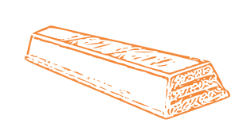

# 
### A code framework for VexVR Python.
### You type the coords, and we do the rest.

by the Orange Hersheys 

## Reference:

**Leave comments of new Ideas to add to the framework, we really want the input!**

####   Legend:
       str::value: type :: what_it_is
       Coord: [int::x, int::y]
       *something: any amount of {something}
       (thing1|thing2): accepts either value
       something?: arg is optional

####   e.move(*Coord)

####   e.pickup(Coord)
       active magnet, move to coord
####   e.pickup(Coord, "return")
       normal, but returns to previous coord
####   e.pickup(Coord, Coord)
        normal, but after first move, it goes to second.

####   e.drop(Coord)
       move to coord, deactive magnet
####   e.drop(Coord, "return")
       normal, but returns to previous coord
####   e.drop(Coord, Coord)
       normal, but after first move, it goes to second.

####   e.pen(*Color|Position)
       enter a Pen color or position, and it does that.

####   e.print(message, color?)

####   e.sync()
       syncs the threads to improve accuracy after a few moves.

####   settings = settings() -- Location: under beware in Settings
       lets you choose the settings for the program.

       unit:   changes the unit the program is in (INCH|MM)
       strict: If True, syncs after every move,
           slows down the bot, but improves accuracy.

> ### don't sue us VEX, **please**
> \- us
